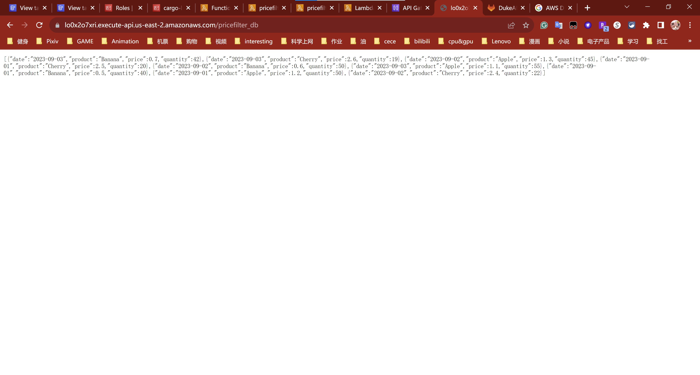
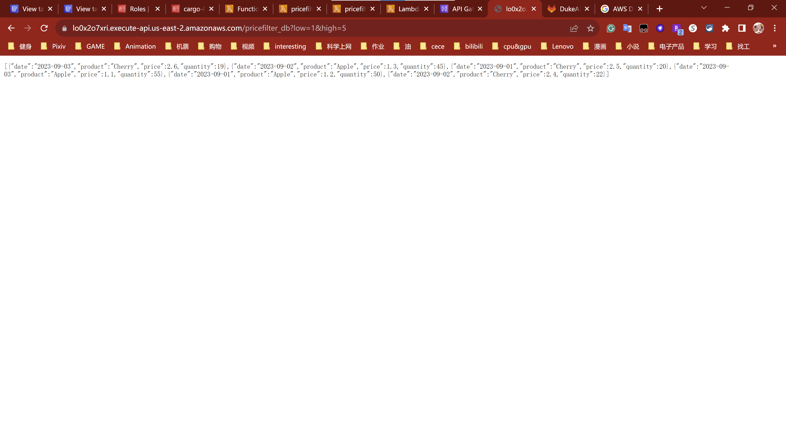
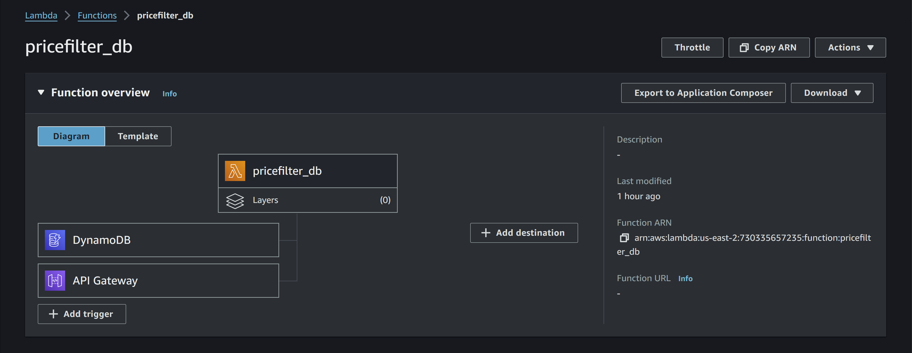

# ids721-mini5

My code is based on my mini-project 2 here is the link: [GitLab Repository](https://gitlab.com/dukeaiml/IDS721/yx248-mini2)
<br>
For this project I use the AWS DynamoDB instead of the S3 bucket.

## Links
- [Deployed Lambda Function on AWS](https://lo0x2o7xri.execute-api.us-east-2.amazonaws.com/pricefilter_db)
<br>
    If use the url without any parameters, it will default low = 0 and high = 10000, which means will show all data.
    If you need to use other parameters, please assign values to variable, for example:
    <br>
    [https://lo0x2o7xri.execute-api.us-east-2.amazonaws.com/pricefilter_db?low=1.2&high=2](https://lo0x2o7xri.execute-api.us-east-2.amazonaws.com/pricefilter_db?low=1.2&high=2)

- [GitLab Repository](https://gitlab.com/dukeaiml/IDS721/yx248-mini5)

## Installation

Before you begin, ensure you have `Rust`, `brew`, and `Cargo Lambda` installed on your system.

### Rust Installation
1. **Download and Install Rust**
Download the Rust installer: Rust provides an installation script that can be downloaded and executed with a single command. Run the following in your terminal:

    ``` bash
        curl --proto '=https' --tlsv1.2 -sSf https://sh.rustup.rs | sh
    ```

2. **Configure Environment**
Configure your environment: Once the installation is complete, the script will advise you to add the Rust compiler to your PATH. You can do this by running the following command:

    ``` bash
        source $HOME/.cargo/env
    ```

3. **Verify Installation**
Verify the installation: After installation, you can verify that Rust is correctly installed by typing:

    ``` bash
        rustc --version
    ```

### Homebrew Installation
1. **Install Dependencies**
Install Dependencies: Before installing Homebrew, you need to install some dependencies. Run the following command:

    ``` bash
        sudo apt-get update && sudo apt-get install build-essential curl file git
    ```

2. **Install Homebrew**
Install Homebrew: Run the following command to install Homebrew:

    ``` bash
        /bin/bash -c "$(curl -fsSL https://raw.githubusercontent.com/Homebrew/install/HEAD/install.sh)"
    ```

This command downloads and runs the Homebrew installation script.

3. **Add Homebrew to PATH**
Add Homebrew to your PATH: After the installation script is finished, follow the instructions provided in the terminal to add Homebrew to your system's PATH. This typically involves adding some lines to your `.bashrc`, `.zshrc`, or other profile script. For example, you might need to add the following lines to your `~/.bashrc` or `~/.profile` file:

    ``` bash
    echo 'eval "$(/home/linuxbrew/.linuxbrew/bin/brew shellenv)"' >> /home/$USER/.profile
    eval "$(/home/linuxbrew/.linuxbrew/bin/brew shellenv)"
    ```

After adding these lines, you should apply the changes by running:

    ``` bash
        source ~/.profile
    ```

4. **Verify Installation**
Verify the Installation: To verify that Homebrew has been installed correctly, run:

    ``` bash
        brew --version
    ```

### Cargo Lambda Installation
- You can use Homebrew to install Cargo Lambda on macOS and Linux. Run the following commands on your terminal to add our tap, and install it:

    ``` bash
        brew tap cargo-lambda/cargo-lambda
        brew install cargo-lambda
    ```


## Creating and Testing the Project

### Create a New Project
The new subcommand will help you create a new project with a default template. When that's done, change into the new directory:

    ``` bash
        cargo lambda new new-lambda-project && cd new-lambda-project
    ```

### Project Structure:
We will get the project structure looks like:

    ``` bash
        root
        │
        ├── src
        │ └── main.rs
        │
        ├── target
        │ └── ...
        │
        ├── Cargo.lock
        │
        ├── Cargo.toml
        │
        └── .gitignore
    ```

If we need to add some src or modify some funxtion code, we can go into `src` folder to modify the `main.rs` file or add more addition code file or lib folder and files to meet demand.

### Serve the function locally for testing
Run the Lambda emulator built in with the watch subcommand:

    ``` bash
        cargo lambda watch
    ```

### Test your function
- The invoke subcommand can send JSON payloads to the function running locally. Payloads are deserialized into strongly typed Rust structs, and the invoke call will fail if the payload doesn't have the right shape.

- If you're starting with a basic function that only receives events with a `command` field in the payload, you can invoke them with the following command:

    ``` bash
        cargo lambda invoke --data-ascii "{ \"command\": \"hi\" }"
    ```

- If you're starting an HTTP function, you can access it with your browser from the local endpoint: `http://localhost:9000/`. You can also `invoke` HTTP functions with the invoke subcommand, the payload to send will depend if this function receives calls from Amazon API Gateway, Amazon Elastic Load Balancer, or Lambda Function URLs.

- If your function integrates with Amazon API Gateway, you can use one of the payload examples that we provide by using the `--data-example` flag:

    ``` bash
        cargo lambda invoke http-lambda --data-example apigw-request
    ```

### My simple function

#### Price Filter
Get two boundary `high` and `low` to quary data in the range, and return back a json format message as the response.

##### Price Filter Function Sample
1. **Default Sample**
    

2. **Param Sample**
    


## Create DynamoDB Table in AWS

- Search the service DynamoDB in AWS, and click `Create Table` in DynamoDB page.
- After your DynamoDB table created successfully, click `Explore table items` to add items into your table.
- You can add attributes when you create the items, you can choose the attributes type, String, Number, Binary, Set, and other more, then, you can type attributes name as key and values.
- Add `dependencies` in your `Cargo.toml` config file: `rusoto_core` and `rusoto_dynamodb`.
- Import these code in your code files:

``` rust
use rusoto_core::Region;
use rusoto_dynamodb::DynamoDbClient;

let client = DynamoDbClient::new(Region::UsEast2);
```


## deploy project

### create IAM
[IAM Web](https://us-east-1.console.aws.amazon.com/iam/home?region=us-east-2#/home)
Create an acess key and get your access key and your secret access key.

### Build the function to deploy it on AWS Lambda
Use the build subcommand to compile your function for Linux systems:

    ``` bash
        cargo lambda build --release
    ```

### Deploy the function on AWS Lambda
Use the deploy subcommand to upload your function to AWS Lambda. This subcommand requires AWS credentials in your system.

    ``` bash
        cargo lambda deploy
    ```

- INFO: A default execution role for this function will be created when you execute this command. Use the flag --iam-role if you want to use a predefined IAM role. If you get the error about the role creation, check the error message and add the flag in the error message in your deploy command and try it again.

- 
- 


### Integrating with Amazon API Gateway

Once the Lambda function is deployed with the necessary IAM permissions, you can set up an HTTP API via the [Amazon API Gateway](https://us-east-2.console.aws.amazon.com/apigateway/main/apis?).

#### Steps for API Gateway Integration:

1. **Create an HTTP API**:
   Navigate to the Amazon API Gateway console and select the option to create a new HTTP API.

2. **Add Lambda Integration**:
   Choose 'Add integration', then select the Lambda function you've deployed on AWS.

3. **Configure Routes**:
   Define the routes for your API. Each route can be linked to the Lambda function for specific processing.
   - Create the route and specify the integration target (Lambda function).

4. **Deployment and Stages**:
   You can deploy your API using the default stage or create a new one. Once deployed, your function is accessible through Amazon API Gateway.
   - Navigate to 'Deploy/Stages' in the API Gateway console to find the deployed URL for your function.

With these steps, your Lambda function is now integrated with Amazon API Gateway, providing an HTTP endpoint for function invocation.

